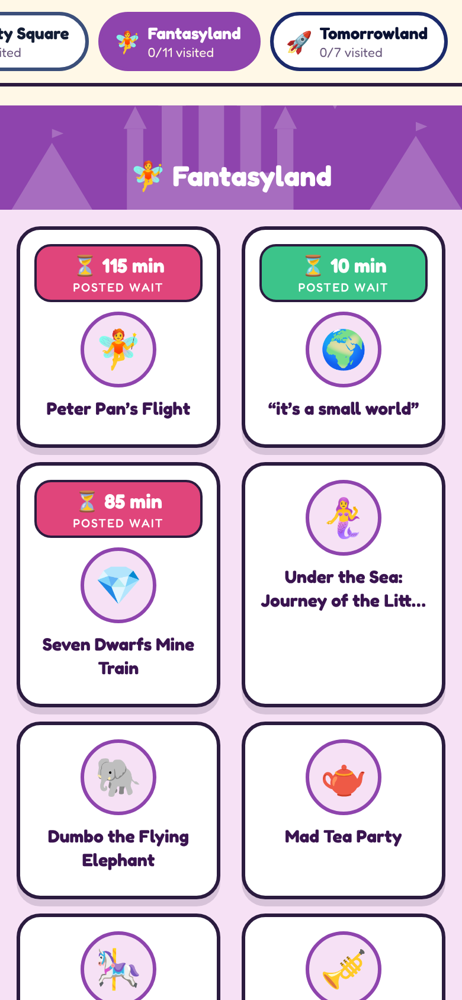
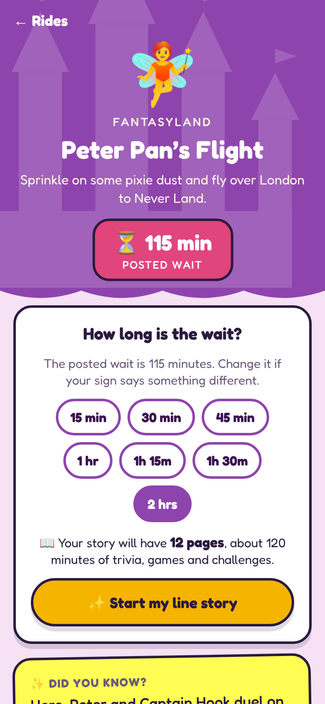
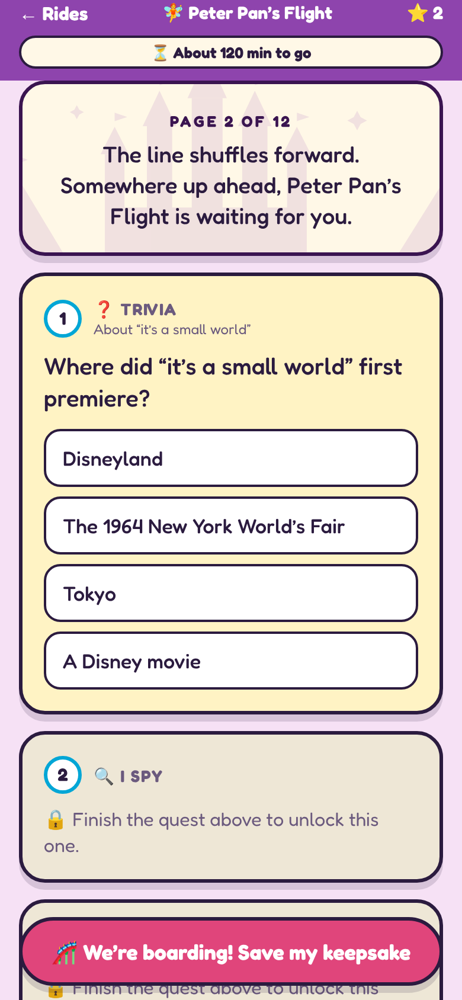
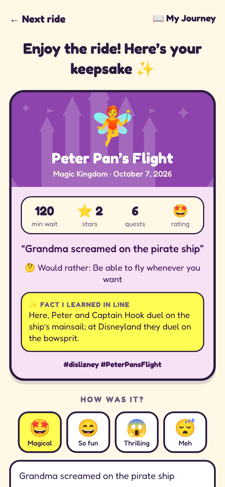

# Once Upon a Line

**Line-time storybook adventures for Walt Disney World**, by Bis Bytes, with Bis the mascot popping up along the way.

Standing in line? Open the app, pick the ride you're waiting for, and get one long scroll of trivia, I Spy hunts, would-you-rathers and group challenges that lasts as long as your wait. When you reach the front, the ride is saved as a keepsake in your own journey, ready to share with your hashtags.

Built for kids, families and grown-ups who still feel like kids. Runs on iPhone, Android and the web from one codebase.

<p>
  
  
  
  
</p>

## What's inside

- **Pick your ride**: every ride in the park, grouped by land, with the posted wait time in big colored badges (green for short, gold for medium, pink for long). Waits come from [Queue-Times.com](https://queue-times.com). While the park is open, rides the live feed says aren't running are hidden, and so are rides closed for an announced refurbishment (`closure` in the park data).
- **Stories sized to your wait**: the app uses the posted wait (or one you pick if the sign says something different) and fills it with one continuous scroll of quests. Every quest is about the ride you're in line for (about 30 per ride); play-anywhere games only appear after a very long wait uses them all up. Every quest is open to play in any order, and more keep appearing as you scroll.
- **Photo spots**: as the line moves, the story points you to real things in the queue worth a picture (the Haunted Mansion's musical crypt, the Darling house in Peter Pan's queue, TRON's color-changing canopy and more, each with a source). Photos are saved on your device, added to the ride's keepsake, and can be shared straight from the line with hashtags.
- **Team play and scoreboards**: add your crew on the ride page (a nickname and an emoji, kept on the phone) and take turns. Trivia goes around the group one player at a time, while I Spy, challenges and photo spots are for everyone. A live scoreboard sits at the top of the line story, the winner gets a 👑 on the keepsake, and My Journey adds up the crew's scores for the whole day.
- **Today's public board (opt in)**: after a ride you can share its points to an anonymous park-wide board. The app makes up a name like "Brave Tiki 42" (the server only accepts names built from its word lists), sends only that name, an emoji and the points, and the board erases itself at 3am Orlando time. (It's a short-lived anonymous store, not a database of players.) Real nicknames, photos and locations never leave the phone.
- **Phones away on the ride**: photo spots are all in the queue, and tapping "We're boarding!" shows a "Phones away, it's ride time!" screen until you're off the ride.
- **Nine quest types**: Trivia, Fact or Fiction, Guess the Number, Put in Order, Emoji Riddles, I Spy, Would You Rather, Group Challenges and Photo Spots.
- **Keepsakes and My Journey**: tap "We're boarding!" and the ride becomes a keepsake card with your wait, stars, a fact you learned, a rating and a memory. Share it as a ready-made picture through the phone's share sheet (Instagram, TikTok, Facebook, Messages…) with a caption written like you're telling friends about the ride, which you can edit first, or share your whole day from the My Journey scrapbook.
- **Storybook flair**: each land has its own illustrated skyline, with sound effects, star bursts and a fanfare when you finish a ride. Sounds can be muted from the cover and respect the phone's silent switch.
- **Facts you can check**: every fact and trivia answer links to its source, and each ride page pulls a live summary from Wikipedia.
- **Fun Fact Radar**: turn it on and the app pops a fun fact (a notification on phones, a banner everywhere) when you're near a ride. Location never leaves your device.
- **Stars, progress and keepsakes**: saved on your device, never uploaded. To keep your journey forever, My Journey can save a backup file (photos included) to iCloud Drive, Google Drive or anywhere you like, and restore it on any phone or browser. Keepsake cards and photos can also be saved to your photo library (or downloaded in a browser).

Magic Kingdom is the first storybook (30 rides and shows across 6 lands). EPCOT, Hollywood Studios and Animal Kingdom are on the shelf as "coming soon."

## Run it

You need [Node.js](https://nodejs.org) 20 or newer.

```bash
npm install
npx expo start
```

Then press `w` for web, or scan the QR code with the Expo Go app on your phone.

To build a web version you can host anywhere:

```bash
npx expo export --platform web   # outputs to dist/
```

### Hosting the public board

The board is a tiny Cloudflare Worker in [`board/`](board/), separate from the app, so the website itself can stay a plain static site (GitHub Pages). It keeps only made-up names, emoji and points, plus the random ids of rides already shared so nothing counts twice, in a Durable Object that erases itself at 3am Orlando time. It keeps no accounts, real names, IP addresses or request logs.

- **Deploy:** add `CLOUDFLARE_API_TOKEN` and `CLOUDFLARE_ACCOUNT_ID` as repo secrets and `.github/workflows/deploy-board.yml` deploys it on every push (or run `cd board && npm install && npx wrangler deploy`). Cloudflare's free plan covers it.
- **Connect the app:** build with `EXPO_PUBLIC_BOARD_URL` set to the Worker's address (for example `https://onceuponaline-board.<you>.workers.dev`). Without it the board is switched off in the app.
- **Try it locally:** `cd board && npx wrangler dev`, then build the app with `EXPO_PUBLIC_BOARD_URL=http://localhost:8787`.

## Project layout

```
src/
  app/                 screens (Expo Router: every file is a route)
    index.tsx          the cover and park shelf
    park/[parkId].tsx  pick your ride, with posted waits
    attraction/[id].tsx ride intro and wait picker
    line/[id].tsx      the line story, sized to the wait
    keepsake/[id].tsx  a shareable keepsake for one ride
    journey.tsx        the My Journey scrapbook
    scoreboard/        today's anonymous public board
    about.tsx
  data/
    types.ts           the content model (Park → Land → Attraction → Quest)
    parks/             one file per park, registered in parks/index.ts
      mk-extra/        more sourced facts and quests for each Magic Kingdom ride
    pools/             park-wide and play-anywhere quests for long waits
  components/          storybook UI pieces
  lib/                 story planner, journey, wait times, progress, radar, Wikipedia
  theme/               colors and fonts
board/                 the public board's Cloudflare Worker
```

## Adding rides, quests and parks

All content lives in plain TypeScript files under `src/data/parks/`. See [CONTRIBUTING.md](CONTRIBUTING.md) for how to add a quest, a ride or a whole new park.

## License

Copyright © 2026 BisBytes. Code and written content: [GNU AGPL v3.0 or later](LICENSE). You can use, change and share it, but if you ship a changed version, or run one as a website or app for other people, you must share your full source under the same license. Versions released before this change stay available under MIT.

The names Once Upon a Line and Bis Bytes, and the Bis mascot artwork, are not covered by the code license. See [TRADEMARKS.md](TRADEMARKS.md).

For other licensing terms, contact BisBytes through [GitHub](https://github.com/bisbytes).

## Who made this

Once Upon a Line was created by BisBytes, who came up with the idea, chose and arranged the rides and activities, set the rules for the content, and directed and reviewed the work. Much of the code was written with an AI coding assistant (Claude) under that direction. Bis is drawn from BisBytes' own character art.

This app is an unofficial fan project and is not affiliated with or endorsed by The Walt Disney Company. Attraction names are trademarks of their respective owners.
