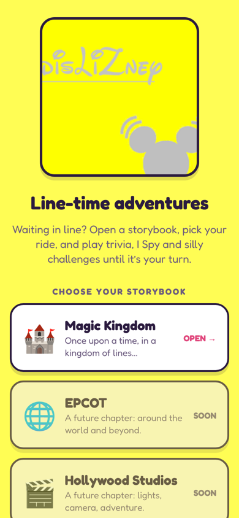
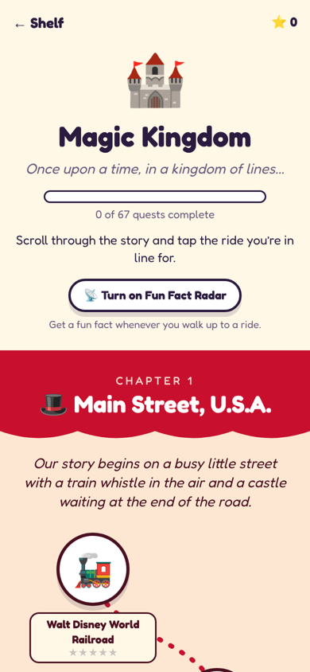
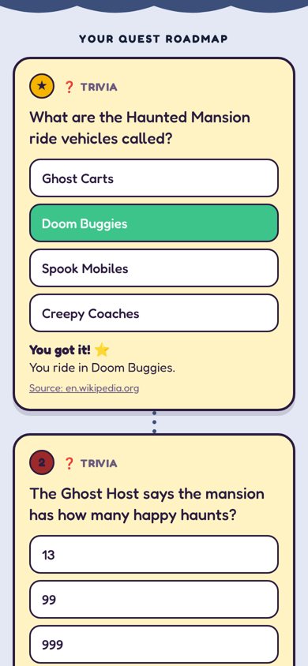
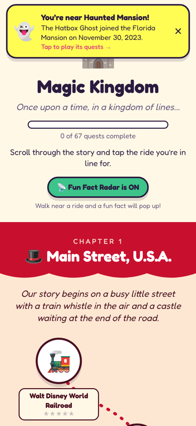

# disLIZney

**Line-time storybook adventures for Walt Disney World.**

Standing in line? Open dislizney, scroll through the park like a storybook, tap the ride you're waiting for, and work your way down a roadmap of trivia, I Spy hunts, would-you-rathers and group challenges. Earn stars, finish chapters, and get a fun fact the moment you walk up to a ride.

Built for kids, families and grown-ups who still feel like kids. Runs on iPhone, Android and the web from one codebase.

<p>
  
  
  
  
</p>

## What's inside

- **Storybook map**: each land is a chapter with its own colors and narration, and rides are stops along a winding path.
- **Quest roadmaps**: every ride has a sequence of quests that unlock one after another. Trivia, I Spy, Would You Rather and Group Challenges.
- **Facts you can check**: every fact and trivia answer links to its source, and each ride page pulls a live summary from Wikipedia.
- **Fun Fact Radar**: turn it on and the app pops a fun fact (a notification on phones, a banner everywhere) when you're near a ride. Location never leaves your device.
- **Stars and progress**: saved on your device.

Magic Kingdom is the first storybook (18 rides, 6 lands). EPCOT, Hollywood Studios and Animal Kingdom are on the shelf as "coming soon."

## Run it

You need [Node.js](https://nodejs.org) 20 or newer.

```bash
npm install
npx expo start
```

Then press `w` for web, or scan the QR code with the Expo Go app on your phone.

To build a web version you can host anywhere:

```bash
npx expo export --platform web   # outputs to dist/
```

## Project layout

```
src/
  app/                 screens (Expo Router: every file is a route)
    index.tsx          the cover and park shelf
    park/[parkId].tsx  the storybook map for a park
    attraction/[id].tsx the quest roadmap for one ride
    about.tsx
  data/
    types.ts           the content model (Park → Land → Attraction → Quest)
    parks/             one file per park, registered in parks/index.ts
  components/          storybook UI pieces
  lib/                 progress, location radar, Wikipedia fetch
  theme/               colors and fonts
```

## Adding rides, quests and parks

All content lives in plain TypeScript files under `src/data/parks/`. See [CONTRIBUTING.md](CONTRIBUTING.md) for how to add a quest, a ride or a whole new park.

## License

[MIT](LICENSE). Code and content contributions are welcome.

dislizney is an unofficial fan project and is not affiliated with or endorsed by The Walt Disney Company. Attraction names are trademarks of their respective owners.
